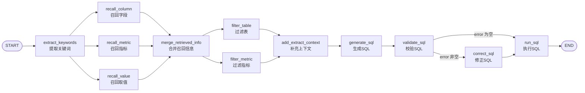

# DataAgent 状态流转解析

> 本文档从整体 Graph 结构出发，解析 `DataAgentState` 在每个节点间的读（依赖）/ 写（产出）变化情况。
> 核心代码：`app/agent/graph.py`、`app/agent/state.py`、`app/agent/context.py`

---

## 一、整体 Graph 结构



### 节点清单

| 序号 | 节点名 | 职责 | 实现状态 |
| --- | --- | --- | --- |
| 1 | `extract_keywords` | 从 query 中提取检索关键词 | ✅ 已实现 |
| 2 | `recall_column` | 召回候选字段（Qdrant 向量检索） | ✅ 已实现 |
| 3 | `recall_metric` | 召回候选指标（Qdrant 向量检索） | ✅ 已实现 |
| 4 | `recall_value` | 召回字段取值（ES 全文检索） | ✅ 已实现 |
| 5 | `merge_retrieved_info` | 合并三类召回结果，整理为表/指标结构 | ✅ 已实现（当前进度） |
| 6 | `filter_table` | 过滤无关表 | ⚪ 占位 |
| 7 | `filter_metric` | 过滤无关指标 | ⚪ 占位 |
| 8 | `add_extract_context` | 补充 SQL 生成所需额外上下文 | ⚪ 占位 |
| 9 | `generate_sql` | 生成 SQL | ⚪ 占位 |
| 10 | `validate_sql` | 校验 SQL 合法性 | 🔶 桩实现（固定返回 `error=None`） |
| 11 | `correct_sql` | 依据校验错误修正 SQL | ⚪ 占位 |
| 12 | `run_sql` | 执行 SQL 并返回结果 | ⚪ 占位 |

---

## 二、State 定义（`app/agent/state.py`）

### 2.1 顶层状态 `DataAgentState`

```python
class DataAgentState(TypedDict):
    query: str                       # 用户原始问题（唯一输入）
    error: str                       # SQL 校验错误信息；None 表示校验通过
    keywords: list[str]              # 提取/扩展后的检索关键词
    retrieved_column_infos: list[ColumnInfo]  # 召回的字段信息
    retrieved_metric_infos: list[MetricInfo]  # 召回的指标信息
    retrieved_value_infos: list[ValueInfo]    # 召回的字段取值
    table_infos: list[TableInfoState]         # 整理后的表信息（含按表分组的字段）
    metric_infos: list[MetricInfoState]       # 整理后的指标信息
```

### 2.2 子状态 `TypedDict`

```python
class MetricInfoState(TypedDict):
    name: str
    description: str
    relevant_columns: list[str]   # 指标依赖的字段 id
    alias: list[str]

class ColumnInfoState(TypedDict):
    name: str
    type: str
    role: str
    examples: list                 # 字段的取值示例（用于给 LLM 提供枚举约束）
    description: str
    alias: list[str]

class TableInfoState(TypedDict):
    name: str
    role: str
    description: str
    columns: list[ColumnInfoState]
```

### 2.3 运行上下文 `DataAgentContext`（只读注入，不参与流转）

```python
class DataAgentContext(TypedDict):
    column_qdrant_repository: ColumnQdrantRepository  # 字段向量库
    embedding_client: HuggingFaceEmbeddings           # 向量化客户端
    metric_qdrant_repository: MetricQdrantRepository  # 指标向量库
    value_es_repository: ValueESRepository            # 取值全文索引
    meta_mysql_repository: MetaMySQLRepository        # 元数据 MySQL
```

> **关键区分**：`state` 是**可变的、逐节点累积**的数据；`context` 是**不可变的依赖注入**，节点通过 `runtime.context[...]` 读取 Repository / Client。

---

## 三、State 生命周期逐节点分析

### 阶段 0：输入

```
query = "统计华北地区的销售总额"
```

只有 `query` 被写入，其余字段为初始值。

---

### 阶段 1：`extract_keywords` 提取关键词

- **读取**：`query`
- **写入**：`keywords`
- **变化详解**：
  1. 使用 `jieba.analyse.extract_tags` 按词性白名单（名词/地名/机构/动词/英文等）抽取关键词；
  2. 将**原始 query 整体**也追加进关键词集合（`set(keywords + query)`），保证"华北地区"这类整体表述不丢失；
  3. 去重后写入 `keywords`。

| 字段 | 变化 |
| --- | --- |
| `keywords` | `[]` → `["华北地区", "销售总额", "统计华北地区的销售总额", ...]` |

---

### 阶段 2：并行召回（fan-out，3 条分支同时执行）

`extract_keywords` 同时连接 `recall_column` / `recall_metric` / `recall_value`，三条分支**并行执行、各自独立写 state**。由于三者写入的 key 不同（`retrieved_column_infos` / `retrieved_metric_infos` / `retrieved_value_infos`），LangGraph 自动合并，**无写冲突**。

三条分支的共性套路：
1. 用 LLM 基于 `query` 扩展关键词（`extend_keywords_for_*_recall` 提示词）；
2. 扩展结果与原关键词合并去重；
3. 逐个关键词检索，按 `id` 去重合并结果。

#### 2.1 `recall_column` 召回字段

- **读取**：`query`、`keywords`
- **写入**：`retrieved_column_infos`
- **变化详解**：
  1. LLM 扩展关键词 → `keywords = set(keywords + result)`；
  2. 对每个关键词做 `aembed_query` 向量化；
  3. 在 Qdrant 中按 `score_threshold=0.6, limit=10` 检索字段；
  4. 以 `column.id` 去重后写入 `retrieved_column_infos`。

> ⚠️ **注意**：当前 `return` 位于 `for keyword` 循环体内部（`recall_column.py:42-45`），实际只处理了第一个关键词即返回，后续关键词未参与检索。

| 字段 | 变化 |
| --- | --- |
| `retrieved_column_infos` | `[]` → `list[ColumnInfo]`（候选字段实体，含 id/name/type/role/examples/alias/table_id） |

#### 2.2 `recall_metric` 召回指标

- **读取**：`query`、`keywords`
- **写入**：`retrieved_metric_infos`
- **变化详解**：与召回字段流程一致，但在 Qdrant 中检索**指标**（默认相似度阈值），按 `metric.id` 去重。

> ⚠️ **注意**：与 `recall_column` 同样存在 `return` 在循环体内的问题（`recall_metric.py:39-42`）。

| 字段 | 变化 |
| --- | --- |
| `retrieved_metric_infos` | `[]` → `list[MetricInfo]`（含 id/name/description/relevant_columns/alias） |

#### 2.3 `recall_value` 召回取值

- **读取**：`query`、`keywords`
- **写入**：`retrieved_value_infos`
- **变化详解**：
  1. LLM 扩展关键词 → 合并去重；
  2. 在 ES 中做**全文检索**（无需向量化）召回字段取值；
  3. 按 `value_info.id` 去重写入 `retrieved_value_infos`。

| 字段 | 变化 |
| --- | --- |
| `retrieved_value_infos` | `[]` → `list[ValueInfo]`（含 id/value/column_id） |

---

### 阶段 3：`merge_retrieved_info` 合并召回信息（fan-in）

三条召回分支在此**汇合**。本节点将三类独立召回结果交叉关联、补齐缺失元数据，并整理成面向 LLM 生成 SQL 的输入结构。

- **读取**：`retrieved_column_infos`、`retrieved_metric_infos`、`retrieved_value_infos`
- **写入**：`table_infos`、`metric_infos`
- **依赖 context**：`meta_mysql_repository`
- **变化详解**：

**Step 1 — 建立字段索引**
以 `column.id` 为 key 构建 `retrieved_column_infos_map`。

**Step 2 — 指标关联字段补全**
遍历 `retrieved_metric_infos`，对每个指标的 `relevant_columns`（依赖字段 id），若不在字段索引中，则从 MySQL 补查 `get_column_info_by_id` 并加入索引。保证指标引用的字段一定存在。

**Step 3 — 取值挂载到字段**
遍历 `retrieved_value_infos`：
- 若取值所属字段不在索引中，先补查 MySQL；
- 将取值 `value` 去重追加到所属字段的 `examples` 中。
> 目的是把"华北地区"这类实际取值作为枚举示例提供给 LLM，辅助 WHERE 条件生成。

**Step 4 — 按表分组**
以 `column.table_id` 为 key 对全部字段分组，得到 `table_to_columns_map`。

**Step 5 — 强制补充主外键字段**
对每个表调用 `get_key_columns_info_by_table_id` 获取 `role in ('primary','foreign_key')` 的字段，若不在该表字段列表则追加。保证 LLM 能看到表间 JOIN 的关联字段。

**Step 6 — 转换输出结构**
- 每个表：查 `get_table_info_by_id` 补齐表名/角色/描述，字段转换为 `ColumnInfoState`；
- 每个指标：转换为 `MetricInfoState`；
- 最终写入 `table_infos`、`metric_infos`。

| 字段 | 变化 |
| --- | --- |
| `table_infos` | `[]` → `list[TableInfoState]`（按表分组、含主外键、字段含取值示例） |
| `metric_infos` | `[]` → `list[MetricInfoState]` |

> ⚠️ 该节点存在 2 处明显问题，详见"七、潜在问题"。

---

### 阶段 4：并行过滤（fan-out，2 条分支）

`merge_retrieved_info` 同时连接 `filter_table` / `filter_metric`，两条分支并行。

- `filter_table`：**读取** `table_infos` → **写入** `table_infos`（过滤无关表）
- `filter_metric`：**读取** `metric_infos` → **写入** `metric_infos`（过滤无关指标）

> ⚪ 当前均为占位节点（仅 `sleep(0.5)`），**未修改任何 state 字段**。实现时注意：由于同一节点写入同一 key，LangGraph 会做**值合并（merge）**，过滤语义需明确是"取交集"还是"覆盖"，否则过滤效果可能丢失。

---

### 阶段 5：`add_extract_context` 补充上下文

- **读取**：`table_infos`、`metric_infos`（推测）
- **写入**：推测为额外的 prompt 上下文字段（当前 state 中尚未定义）
- ⚪ 占位节点。注意：若需新增 state 字段（如 `extra_context` / `table_info_str`），需先在 `state.py` 中补充定义。

---

### 阶段 6：SQL 生成与执行链路（串行）

#### `generate_sql` 生成 SQL
- **读取**：`query`、`table_infos`、`metric_infos`、补充上下文
- **写入**：推测为 SQL 字符串（如 `sql` 字段，当前 state 中尚未定义）
- ⚪ 占位节点。

#### `validate_sql` 校验 SQL
- **读取**：SQL 结果
- **写入**：`error`（`None` = 校验通过；非空 = 错误信息）
- 🔶 当前桩实现：固定 `return {'error': None}`，即**永远走 `run_sql` 分支**。

#### 条件路由（conditional edge）
```python
# graph.py:59-61
graph_builder.add_conditional_edges(
    source="validate_sql",
    path=lambda state: "run_sql" if state['error'] is None else "correct_sql",
    path_map={"run_sql": "run_sql", "correct_sql": "correct_sql"},
)
```
- `error is None` → `run_sql`（直接执行）
- `error` 非空 → `correct_sql`（先修正）

> ⚠️ **设计注意**：`correct_sql → run_sql` 是**无条件边**，即 SQL 修正后**不再二次校验**直接执行。若要"修正-校验-再修正"循环，需改造为条件边（参考 `MAX_RETRY` 限制避免死循环）。

#### `run_sql` 执行 SQL
- **读取**：SQL
- **写入**：查询结果（推测 `result` 字段）
- ⚪ 占位节点，最终 `run_sql → END`。

---

## 四、State 字段流转总表

| 字段 | 初始值 | 写入节点 | 读取节点 | 最终用途 |
| --- | --- | --- | --- | --- |
| `query` | 用户输入 | —（外部注入） | extract_keywords / recall_* | 检索与生成的根因 |
| `keywords` | 空 | extract_keywords | recall_column / recall_metric / recall_value | 驱动三类召回 |
| `retrieved_column_infos` | 空 | recall_column | merge_retrieved_info | 合并阶段的字段来源 |
| `retrieved_metric_infos` | 空 | recall_metric | merge_retrieved_info | 合并阶段的指标来源 |
| `retrieved_value_infos` | 空 | recall_value | merge_retrieved_info | 合并阶段的取值来源 |
| `table_infos` | 空 | merge_retrieved_info → filter_table | add_extract_context / generate_sql | SQL 生成所需的表结构上下文 |
| `metric_infos` | 空 | merge_retrieved_info → filter_metric | add_extract_context / generate_sql | SQL 生成所需的指标上下文 |
| `error` | 空 | validate_sql / correct_sql（推测） | 条件路由 | 决定走 run_sql 还是 correct_sql |
| `sql`（推测） | 空 | generate_sql | validate_sql / correct_sql / run_sql | 待补 state 字段 |
| `result`（推测） | 空 | run_sql | 最终输出 | 待补 state 字段 |

---

## 五、并行与合并语义

| 结构 | 涉及节点 | 说明 |
| --- | --- | --- |
| **fan-out（并行分发）** | `extract_keywords → recall_column/recall_metric/recall_value` | 三类召回互不依赖，可并行 |
| **fan-out（并行分发）** | `merge_retrieved_info → filter_table/filter_metric` | 表、指标过滤互不依赖 |
| **fan-in（并行合并）** | `recall_* → merge_retrieved_info` | 三路写入不同 key，自动合并无冲突 |
| **fan-in（并行合并）** | `filter_* → add_extract_context` | 两路各自写 key，需注意同名 key 的合并策略 |

> LangGraph 中并行分支写入**不同 key** 时自动合并；写入**相同 key** 时按默认 reducer（覆盖/合并）处理。实现 `filter_table` / `filter_metric` 时务必确认 reducer 语义。

---

## 六、当前实现进度一览

```
extract_keywords → recall_* → merge_retrieved_info ✅
                                        ↓
filter_table / filter_metric ⚪        (待实现)
add_extract_context ⚪                 (待实现)
generate_sql ⚪                        (待实现)
validate_sql 🔶 (桩)                   (待实现)
correct_sql / run_sql ⚪               (待实现)
```

- ✅ **已完成**：检索链路（关键词 → 三类召回 → 合并整理），已具备"可召回并结构化表/指标信息"的能力。
- ⚪ **待完成**：过滤、上下文补充、SQL 生成、校验、修正、执行，以及结果字段的 state 定义。

---

## 七、发现的潜在问题（建议优先处理）

1. **`merge_retrieved_info.py:52` 语法错误**：`table_to_columns_map.key()` 应为 `table_to_columns_map.keys()`，当前写法会直接抛 `AttributeError`。
2. **`merge_retrieved_info.py:42-48` 与 `:62-67` 重复分组**：第一段按表分组逻辑被第二段整体覆盖，前段是死代码，应删除其一。
3. **空值风险**：`get_column_info_by_id` / `get_table_info_by_id` 查无记录时返回 `None`，`merge_retrieved_info` 中直接赋值/取值会抛 `AttributeError`，需空值兜底。
4. **`recall_column.py:42-45` / `recall_metric.py:39-42` 提前 return**：`return` 写在 `for keyword` 循环体内，只处理首个关键词即返回，多关键词召回失效，应移出循环。
5. **`correct_sql → run_sql` 无条件边**：修正后不重新校验，且无最大重试次数限制，存在死循环风险（当前 `validate_sql` 恒返回 `None` 未触发）。
6. **`get_key_columns_info_by_table_id`**：使用 `ColumnInfo(**dict(row))`，要求 `column_info` 表字段与 `ColumnInfo` dataclass 字段**完全一致**（含 `examples`、`alias` 等），若表结构存在额外字段（如 `created_at`）会抛 TypeError，需确认或改用显式映射。
